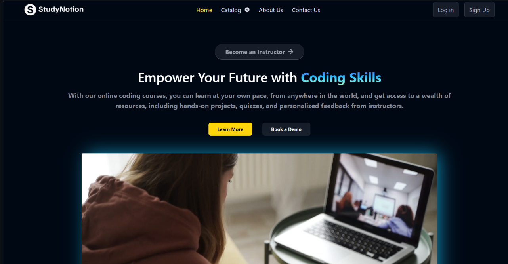

<h1 align="center">
  🚀 Milind Patel's Portfolio
</h1>

  

  
  
  

---

## 🖥️ Live Demo

Check out the live demo of my portfolio [here](#).

---

## ✨ Features

- Responsive design for all devices
- Animated hero section with dynamic typing effect
- Projects showcase with interactive cards
- Skills section with tech stack icons
- Contact form for easy communication
- Downloadable resume

---

## 📸 Preview

  
  

---

## 🛠️ Tech Stack

  
  
  
  
  
  
  
  
  
  
  
  

---

## 📂 Projects

| Project Name         | Description                       | Live Link | Repo Link |
|----------------------|-----------------------------------|-----------|-----------|
| Study Notion         | Study Courses Provider            | [Live](https://github.com/iammilindpatel/Study-Notion) | [Repo](https://github.com/iammilindpatel/Study-Notion) |
| Shopping Cart        | Shopping Cart Functionality       | [Live](https://github.com/iammilindpatel/Shopping-Cart.git) | [Repo](https://github.com/iammilindpatel/Shopping-Cart.git) |
| Password Generator   | Password Generating Tool          | [Live](https://github.com/iammilindpatel/Password-Generator.git) | [Repo](https://github.com/iammilindpatel/Password-Generator.git) |
| Live Weather         | Provides Live Weather             | [Live](https://github.com/iammilindpatel/Live-Weather.git) | [Repo](https://github.com/iammilindpatel/Live-Weather.git) |
| Razorpay             | Fintech World                     | [Live](https://github.com/iammilindpatel/Razorpay.git) | [Repo](https://github.com/iammilindpatel/Razorpay.git) |

---

## 📬 Contact

Feel free to reach out via [LinkedIn](#) or use the contact form on the website!

---

  

  <b>@milind patel</b>

